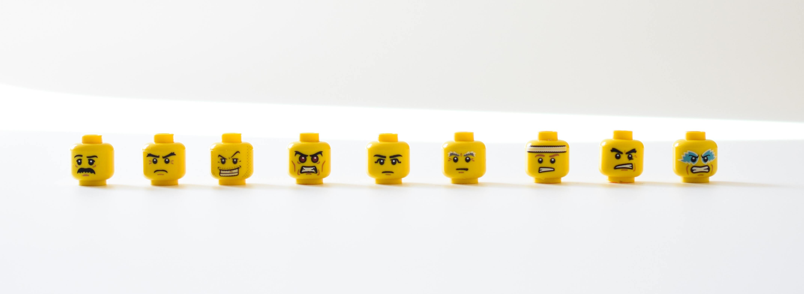

# DeepFeelings
DeepFeelings is project created to know the impact of a brand, or a product, on social media.

It differentiates between positive, neutral, and negative comments, in total and during a timeline, and it gives the most common topics surrounding  it.

# Demo

# Table of contents
- [Project Title](#DeepFeelings)
- [Demo](#demo)
- [Table of contents](#table-of-contents)
- [Usage](#usage)
- [Models and Tools Used](#models-and-tools-used)

# Usage
Work in progress

# Models and Tools Used
* Web scraping with Selenium to collect Amazon reviews
* Twitter API to collect tweets
* RoBERTa: for Sentiment Analysis
* Latent Dirichlet Allocation for clustering topics
* Data Visualization with matplotlib and plotly deployed on streamlit
